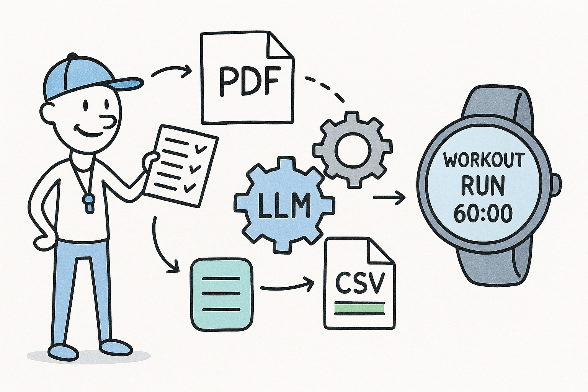

# 🏃‍♂️ Garmin Workouts Pipeline



A lightweight but ambitious experiment that combines **Large Language Models (LLMs via API)**, **ETL principles**, and the **Garmin FIT SDK** to create a semi-automated pipeline for structured training generation — from unstructured **PDF training plans** to **Garmin-compatible FIT workouts**.

Built in Python, with a runner's heart ❤️ and a developer's mindset.

---

## 📌 Overview

This project processes training plans (originally in Portuguese) using OCR and Markdown conversion, then applies an **LLM (via Azure OpenAI API)** to:

1. Parse the Markdown and extract structured JSON workouts (duration, intensity, etc.);
2. Convert these JSON objects into CSVs compatible with Garmin's **FitCSVTool** format;
3. Generate `.fit` files ready to upload to **Garmin Connect**.

---

## 🔧 Requirements

- Python 3.10+
- Java 8+ (required for encoding FIT files)
- [Garmin FIT SDK](https://developer.garmin.com/): download and place `FitCSVTool.jar` inside `tools/`
- WSL recommended (for better compatibility with OCR tools)
- OpenAI or Azure OpenAI API Key

```bash
pip install -r requirements.txt
```

---

## 🚀 How It Works

1. **📄 Convert PDF to Markdown**
   - Uses [Docling](https://pypi.org/project/docling/) to extract `.md` from training PDFs.

2. **🧠 LLM to JSON**
   - GPT-4 API parses Markdown and returns structured JSON for each workout (e.g., `wkt_name`, `steps`, `duration`, `intensity`, `zones`, etc.).

3. **🛠️ JSON to CSV**
   - Python scripts convert JSON into Garmin-compatible CSVs using field mapping rules.
   - Manual override supported for fine-tuned control.

4. **⚙️ CSV to FIT**
   - Encoded using Garmin’s `FitCSVTool.jar`.

---

## ✅ Results

- Workouts like `S3T1.fit`, `S3T2.fit`, `S3T3.fit` successfully generated
- CSVs validated and passed through Garmin’s tools
- Modular ETL pipeline ready for automation

---

## 🧪 Motivation

> "This project connects my passion for running 🏃 with my obsession for automation and language models. It’s not perfect, but it’s real — and that’s what matters."

A running-themed AI-powered ETL pipeline. Because why not?

---

## 📌 Known Limitations & Future Improvements

### ✅ Handled manually for now:
- LLM sometimes merges multiple workouts into one
- Inconsistent parsing of repetitions and heart rate zones

### 📃 On the roadmap:
- 🛡️ **API integration with [Intervals.icu](https://intervals.icu/)** for automated Garmin Connect sync
- 🔧 Improve prompt design & Markdown grammar for better LLM parsing
- 🧱 Add JSON schema validation + CSV verification
- 🧠 Explore fine-tuning or rule-based fallback logic

---

## 🛠️ Stack & Tools

- [Garmin FIT SDK](https://developer.garmin.com/)
- [OpenAI Python SDK](https://github.com/openai/openai-python)
- Azure OpenAI API (GPT-4o)
- [Docling](https://pypi.org/project/docling/)

---

## 📌 Notes

- `FitCSVTool.jar` **is not distributed** in this repository due to Garmin's license.
  Please [download it from the official SDK](https://developer.garmin.com/) and place it in `tools/`.

- This is a **work-in-progress** pipeline. Your ideas, PRs, and issues are welcome.

